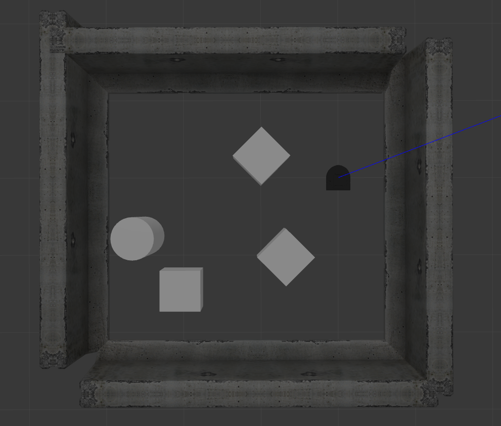
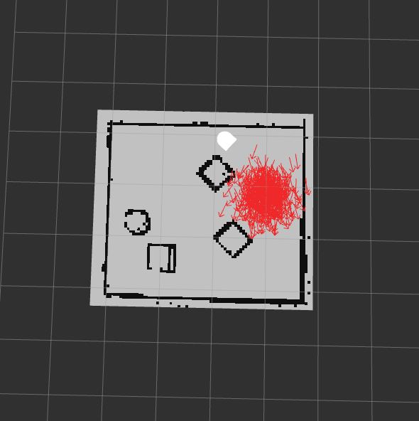
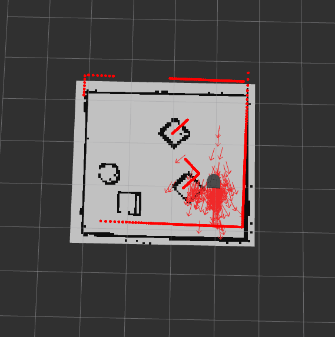
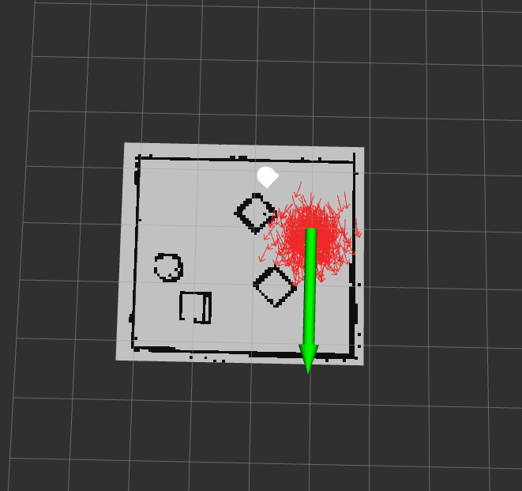

# Robot Localization Project
## By: Gabrielle Blake

### About the Project

The goal of this project was to find the location of a robot's pose in real time given an initial pose estimate, laser scan data,odometry data, and a known map, using a Monte Carlo particle filter. The purpose of the particle filter is to find the robot's exact position however, given the noise and inaccuracy of the laser scan and odometry sensors. The cornerstones of this project included understanding how the particle filter algorithm worked, how poses and odometry are represented across coordinate frames, and working with Rviz, the Gazebo simulator, and ROS to implement and debug code.

---
### Solving the Problem

This problem can be solved by implementing a particle filter algorithm to find the most likely location of the robot at a given time, taking into the account the noise of sensors. The idea behind a particle filter is that particles are initialized throughout a given map to represent many possible poses (position and orientation) of the robot. 

Figure 2 shows this initialization of the particle cloud around the initial robot pose estimate, with the robot's real position shown in Gazebo in Figure 1. As can be seen, the red cluster of particles is spawned around that initial position. As the robot moves through space, the particles are also updated to move similarly but with some noise added to account for the sensor imperfection and include poses of where the robot actually is and not just where the odometry sensor says it is.

Figure 1

Figure 2

In order to evaluate the probability a given particle represents where the robot actually is, the laser scans the robot is publishing are superimposed onto the map from the frame of each particle and the similarities between these scans and the real scan are evaluated such that particles with scans that have high similarity to the real scan are given higher weights as they are more likely poses. The particle filter's best estimate of the robot's real pose is the average of the particles' poses. As seen in Figure 3, the better the particle filter is working, the more aligned the red laser scan of the map is aligned to the real map shown in black and white.

Figure 3

This process is then repeated over and over such that particles are resampled according to their weights. So more particles are initialized in the next iteration in the areas of the map where particles with high weights from the previous iteration existed, until the particles converge around the area the robot is most likely to be.

If the particle filter begins to show signs that its prediction of the robot's pose has become too off, one can give the filter a new initial estimate to "reset" the filter. Giving the filter a new initial pose through Rviz is shown below in Figure 4. The green arrow represents the new pose with its direction being orientation and its tail being the *x,y* position.

Figure 4

A high level structure of how the particle filter was implemented in code is as follows:
1. Initialize a set of particles in the map frame via random sampling
2. Update the particles using data from robot's odometry in the odom frame
3. Re-weight the particles based on their compatibility with the laser scan (which is in the baselink frame)
4. Resample with replacement a new set of particles with probability proportional to their weights.
5. Update the estimate of the robot’s pose given the new particles. Update the map to odom transform.

---
### Key Design Decisions

A design decision I had to make early on when working on this project was how I was going to resample the particles given their weights from the previous iteration of the filter. At first I considered the high weight areas and how to make the center of these areas the new means/peaks of the probability distribution. One method I considered was random sampling using a normal distribution around the *x* number of particles with the highest weights, such that these particles would be the "epicenters" of the particle distribution in the next iteration. However, a simpler and more accurate method I found and then decided upon was to use the weight distribution of the particles as the new probability distribution from which to sample new particles. This method not only biased towards higher weighted particles as intended, but it also allowed for some lower weighted particles to still be generated to prevent the filter from getting overconfident and converging on a poor estimated location.

A design decision I had to make towards the end of this project was how to estimate the pose of the robot based on the particles. The two most popular methods were to take the mean pose of the particles or the most likely pose. I tried both methods, taking the average x. y, and theta of all the particles to find the mean pose, and finding the particle with the highest weight, respectively. I found that taking the mean pose was better than taking the most likely one. I also did some hard coding adding value to the x and y position of the mean pose as I found the robot appeared to fall a little behind the center of the particle cloud in Rviz, so I modified the x and y positions so it would be more centered in the cloud.

---
### Challenges

One challenge I faced along the way for this project was figuring out the correct trigonometric functions to apply at various steps of the filter. I understood the concepts at a high level, but implementing it in code was slightly different process. I could understand and code the first 70% of what transformations needed to be applied to when updating particles based on the odometry of the robot and weighting particles by evaluating their proposed scans to the real scan, but I usually had to go to office hours or ask the professors for assistance in understanding and implementing the last 30%.

---
### Future Improvements

First, I would also remove the hard code I mentioned in the *Key Design Decisions* section and find a better, more automated and logical way to improve the estimated robot pose. Also, I noticed that when the robot was purely rotating and changing its orientation, the particle filter would perform its worst, and once  it was driving straight, the filter would be able to locate the robot more accurately and stably. I suspect that the less-than-ideal updating of the robot pose estimate and the decreased accuracy when turning are due to computational inefficiency. The filter is too slow compared to the robot's actual change in pose over time. So, making the filter faster and more efficient would be the next thing to do. These observations in the efficiency of the filter can be seen in the ros bag file called *demo-2* in the *bags* folder.

If I had more time I would also have tried implementing the adaptive version of the Monte Carlo particle filter which I researched and found to be a more computationally efficient particle filter and a good future challenge. 

---
### Lessons

Some interesting lessons I learned for future robotics projects is to test the code in sections rather than trying to run the whole program at once every time. I also learned how valuable debugging mode in VS Code can be when looking for issues in the program. Thanks to these lessons, this project went pretty smoothly for me in terms of building up my program and testing it.